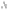
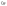

# SchemaLib List

## Circuit Elements

<table>
  <thead>
  <tr>
    <th>Name</th>
    <th>Description</th>
    <th>Large (*-l)</th>
    <th>Medium (*-m)</th>
    <th>Small (*-s)</th>
  </tr>
  </thead>
  <tbody>
   <tr>
    <td>schemalib-bus</td>
    <td>Wiring bus</td>
    <td style="text-align: center" colspan="4"></td>
  </tr>
   <tr>
    <td>schemalib-currrent</td>
    <td>Current direction</td>
    <td style="text-align: center" colspan="4"></td>
  </tr>
  <tr>
    <td>schemalib-gnd-*</td>
    <td>Ground</td>
    <td style="text-align: center"></td>
    <td style="text-align: center"></td>
    <td style="text-align: center"></td>
  </tr>
  <tr>
    <td>schemalib-gnd-shield-*</td>
    <td>Ground (shield)</td>
    <td style="text-align: center"></td>
    <td style="text-align: center"></td>
    <td style="text-align: center"></td>
  </tr>
   <tr>
    <td>schemalib-solder-dot</td>
    <td>Wiring connection</td>
    <td style="text-align: center" colspan="4"></td>
  </tr>
  <tr>
    <td>schemalib-supply-*</td>
    <td>Global supply</td>
    <td style="text-align: center"></td>
    <td style="text-align: center"></td>
    <td style="text-align: center"></td>
  </tr>
   <tr>
    <td>schemalib-term</td>
    <td>Wiring terminal</td>
    <td style="text-align: center" colspan="4"></td>
  </tr>
   <tr>
    <td>schemalib-term-coax</td>
    <td>Wiring terminal (coaxial)</td>
    <td style="text-align: center" colspan="4"></td>
  </tr>
   <tr>
    <td>schemalib-term-pad</td>
    <td>Wiring terminal (pad)</td>
    <td style="text-align: center" colspan="4"></td>
  </tr>
   <tr>
    <td>schemalib-term-triax</td>
    <td>Wiring terminal (triaxial)</td>
    <td style="text-align: center" colspan="4"></td>
  </tr>
   <tr>
    <td>schemalib-voltage-minus</td>
    <td>Voltage reference (negative)</td>
    <td style="text-align: center" colspan="4"></td>
  </tr>
   <tr>
    <td>schemalib-voltage-plus</td>
    <td>Voltage reference (positive)</td>
    <td style="text-align: center" colspan="4"></td>
  </tr>
  </tbody>
</table>

## Analog Devices

<table>
  <thead>
  <tr>
    <th>Name</th>
    <th>Description</th>
    <th>Large (*-l)</th>
    <th>Medium (*-m)</th>
    <th>Small (*-s)</th>
  </tr>
  </thead>
  <tbody>
  <tr>
    <td>schemalib-antenna-regular-*</td>
    <td>Antenna</td>
    <td style="text-align: center"></td>
    <td style="text-align: center"></td>
    <td style="text-align: center"></td>
  </tr>
  <tr>
    <td>schemalib-antenna-rx-*</td>
    <td>Antenna (receiving state)</td>
    <td style="text-align: center"></td>
    <td style="text-align: center"></td>
    <td style="text-align: center"></td>
  </tr>
  <tr>
    <td>schemalib-antenna-tx-*</td>
    <td>Antenna (transmitting state)</td>
    <td style="text-align: center"></td>
    <td style="text-align: center"></td>
    <td style="text-align: center"></td>
  </tr>
  <tr>
    <td>schemalib-bjt-npn-*</td>
    <td>Bipolar junction transistor (NPN-type)</td>
    <td style="text-align: center"></td>
    <td style="text-align: center"></td>
    <td style="text-align: center"></td>
  </tr>
  <tr>
    <td>schemalib-bjt-pnp-*</td>
    <td>Bipolar junction transistor (PNP-type)</td>
    <td style="text-align: center"></td>
    <td style="text-align: center"></td>
    <td style="text-align: center"></td>
  </tr>
  <tr>
    <td>schemalib-cap-nonlinear-*</td>
    <td>Capacitor (non-linear)</td>
    <td style="text-align: center"></td>
    <td style="text-align: center"></td>
    <td style="text-align: center"></td>
  </tr>
  <tr>
    <td>schemalib-cap-polarity-*</td>
    <td>Capacitor (asymmetrical)</td>
    <td style="text-align: center"></td>
    <td style="text-align: center"></td>
    <td style="text-align: center"></td>
  </tr>
  <tr>
    <td>schemalib-cap-regular-*</td>
    <td>Capacitor</td>
    <td style="text-align: center"></td>
    <td style="text-align: center"></td>
    <td style="text-align: center"></td>
  </tr>
  <tr>
    <td>schemalib-cap-tunable-*</td>
    <td>Capacitor (tunable)</td>
    <td style="text-align: center"></td>
    <td style="text-align: center"></td>
    <td style="text-align: center"></td>
  </tr>
  <tr>
    <td>schemalib-diode-led-*</td>
    <td>Diode (LED)</td>
    <td style="text-align: center"></td>
    <td style="text-align: center"></td>
    <td style="text-align: center"></td>
  </tr>
  <tr>
    <td>schemalib-diode-photocond-*</td>
    <td>Diode (photoconductive)</td>
    <td style="text-align: center"></td>
    <td style="text-align: center"></td>
    <td style="text-align: center"></td>
  </tr>
  <tr>
    <td>schemalib-diode-photovolt-*</td>
    <td>Diode (photovoltaic)</td>
    <td style="text-align: center"></td>
    <td style="text-align: center"></td>
    <td style="text-align: center"></td>
  </tr>
  <tr>
    <td>schemalib-diode-regular-*</td>
    <td>Diode</td>
    <td style="text-align: center"></td>
    <td style="text-align: center"></td>
    <td style="text-align: center"></td>
  </tr>
  <tr>
    <td>schemalib-diode-zener-*</td>
    <td>Diode (Zener)</td>
    <td style="text-align: center"></td>
    <td style="text-align: center"></td>
    <td style="text-align: center"></td>
  </tr>
  <tr>
    <td>schemalib-electrochem-*</td>
    <td>Amperometric electrochemical sensor</td>
    <td style="text-align: center"></td>
    <td style="text-align: center"></td>
    <td style="text-align: center"></td>
  </tr>
  <tr>
    <td>schemalib-fuse-off-*</td>
    <td>Fuse (burned state)</td>
    <td style="text-align: center"></td>
    <td style="text-align: center"></td>
    <td style="text-align: center"></td>
  </tr>
  <tr>
    <td>schemalib-fuse-on-*</td>
    <td>Fuse (unburned state)</td>
    <td style="text-align: center"></td>
    <td style="text-align: center"></td>
    <td style="text-align: center"></td>
  </tr>
  <tr>
    <td>schemalib-ind-coup-*</td>
    <td>Inductor (with coupling)</td>
    <td style="text-align: center"></td>
    <td style="text-align: center"></td>
    <td style="text-align: center"></td>
  </tr>
  <tr>
    <td>schemalib-ind-nonlinear-*</td>
    <td>Inductor (non-linear)</td>
    <td style="text-align: center"></td>
    <td style="text-align: center"></td>
    <td style="text-align: center"></td>
  </tr>
  <tr>
    <td>schemalib-ind-regular-*</td>
    <td>Inductor</td>
    <td style="text-align: center"></td>
    <td style="text-align: center"></td>
    <td style="text-align: center"></td>
  </tr>
  <tr>
    <td>schemalib-ind-transf-*</td>
    <td>Inductor (transformer with core)</td>
    <td style="text-align: center"></td>
    <td style="text-align: center"></td>
    <td style="text-align: center"></td>
  </tr>
  <tr>
    <td>schemalib-ind-transfx-*</td>
    <td>Inductor (cross-coupled transformer with core)</td>
    <td style="text-align: center"></td>
    <td style="text-align: center"></td>
    <td style="text-align: center"></td>
  </tr>
  <tr>
    <td>schemalib-ind-tunable-*</td>
    <td>Inductor (tunable)</td>
    <td style="text-align: center"></td>
    <td style="text-align: center"></td>
    <td style="text-align: center"></td>
  </tr>
  <tr>
    <td>schemalib-isfet-n-noref-bulk-*</td>
    <td>ISFET sensor (N-type, bulk term)</td>
    <td style="text-align: center"></td>
    <td style="text-align: center"></td>
    <td style="text-align: center"></td>
  </tr>
  <tr>
    <td>schemalib-isfet-n-noref-nobulk-*</td>
    <td>ISFET sensor (N-type)</td>
    <td style="text-align: center"></td>
    <td style="text-align: center"></td>
    <td style="text-align: center"></td>
  </tr>
  <tr>
    <td>schemalib-isfet-n-ref-bulk-*</td>
    <td>ISFET sensor (N-type, ref electrode, bulk term)</td>
    <td style="text-align: center"></td>
    <td style="text-align: center"></td>
    <td style="text-align: center"></td>
  </tr>
  <tr>
    <td>schemalib-isfet-n-ref-nobulk-*</td>
    <td>ISFET sensor (N-type, ref electrode)</td>
    <td style="text-align: center"></td>
    <td style="text-align: center"></td>
    <td style="text-align: center"></td>
  </tr>
  <tr>
    <td>schemalib-mic-diff-*</td>
    <td>Microphone (differential)</td>
    <td style="text-align: center"></td>
    <td style="text-align: center"></td>
    <td style="text-align: center"></td>
  </tr>
  <tr>
    <td>schemalib-mic-diff-rec-*</td>
    <td>Microphone (differential, recording state)</td>
    <td style="text-align: center"></td>
    <td style="text-align: center"></td>
    <td style="text-align: center"></td>
  </tr>
  <tr>
    <td>schemalib-mic-rec-*</td>
    <td>Microphone (recording state)</td>
    <td style="text-align: center"></td>
    <td style="text-align: center"></td>
    <td style="text-align: center"></td>
  </tr>
  <tr>
    <td>schemalib-mic-regular-*</td>
    <td>Microphone</td>
    <td style="text-align: center"></td>
    <td style="text-align: center"></td>
    <td style="text-align: center"></td>
  </tr>
  <tr>
    <td>schemalib-mosfet-n-bulk-*</td>
    <td>MOS field-effect transistor (N-type, bulk term)</td>
    <td style="text-align: center"></td>
    <td style="text-align: center"></td>
    <td style="text-align: center"></td>
  </tr>
  <tr>
    <td>schemalib-mosfet-n-nobulk-*</td>
    <td>MOS field-effect transistor (N-type)</td>
    <td style="text-align: center"></td>
    <td style="text-align: center"></td>
    <td style="text-align: center"></td>
  </tr>
  <tr>
    <td>schemalib-mosfet-p-bulk-*</td>
    <td>MOS field-effect transistor (P-type, bulk term)</td>
    <td style="text-align: center"></td>
    <td style="text-align: center"></td>
    <td style="text-align: center"></td>
  </tr>
  <tr>
    <td>schemalib-mosfet-p-nobulk-*</td>
    <td>MOS field-effect transistor (P-type)</td>
    <td style="text-align: center"></td>
    <td style="text-align: center"></td>
    <td style="text-align: center"></td>
  </tr>
  <tr>
    <td>schemalib-res-cursor-*</td>
    <td>Resistor (with cursor)</td>
    <td style="text-align: center"></td>
    <td style="text-align: center"></td>
    <td style="text-align: center"></td>
  </tr>
  <tr>
    <td>schemalib-res-nonlinear-*</td>
    <td>Resistor (nonlinear)</td>
    <td style="text-align: center"></td>
    <td style="text-align: center"></td>
    <td style="text-align: center"></td>
  </tr>
  <tr>
    <td>schemalib-res-photo-*</td>
    <td>Resistor (photosensor)</td>
    <td style="text-align: center"></td>
    <td style="text-align: center"></td>
    <td style="text-align: center"></td>
  </tr>
  <tr>
    <td>schemalib-res-regular-*</td>
    <td>Resistor</td>
    <td style="text-align: center"></td>
    <td style="text-align: center"></td>
    <td style="text-align: center"></td>
  </tr>
  <tr>
    <td>schemalib-res-tunable-*</td>
    <td>Resistor (tunable)</td>
    <td style="text-align: center"></td>
    <td style="text-align: center"></td>
    <td style="text-align: center"></td>
  </tr>
  <tr>
    <td>schemalib-source-i-ctrl-*</td>
    <td>Source (current, controlled)</td>
    <td style="text-align: center"></td>
    <td style="text-align: center"></td>
    <td style="text-align: center"></td>
  </tr>
  <tr>
    <td>schemalib-source-i-pulse-*</td>
    <td>Source (current, pulsed)</td>
    <td style="text-align: center"></td>
    <td style="text-align: center"></td>
    <td style="text-align: center"></td>
  </tr>
  <tr>
    <td>schemalib-source-i-regular-*</td>
    <td>Source (current)</td>
    <td style="text-align: center"></td>
    <td style="text-align: center"></td>
    <td style="text-align: center"></td>
  </tr>
  <tr>
    <td>schemalib-source-i-sin-*</td>
    <td>Source (current, sinusoidal)</td>
    <td style="text-align: center"></td>
    <td style="text-align: center"></td>
    <td style="text-align: center"></td>
  </tr>
  <tr>
    <td>schemalib-source-v-batt1-*</td>
    <td>Source (voltage, battery, 1 cell)</td>
    <td style="text-align: center"></td>
    <td style="text-align: center"></td>
    <td style="text-align: center"></td>
  </tr>
  <tr>
    <td>schemalib-source-v-batt2-*</td>
    <td>Source (voltage, battery, 2 cells)</td>
    <td style="text-align: center"></td>
    <td style="text-align: center"></td>
    <td style="text-align: center"></td>
  </tr>
  <tr>
    <td>schemalib-source-v-batt3-*</td>
    <td>Source (voltage, battery, 3 cells)</td>
    <td style="text-align: center"></td>
    <td style="text-align: center"></td>
    <td style="text-align: center"></td>
  </tr>
  <tr>
    <td>schemalib-source-v-batt-coin-*</td>
    <td>Source (voltage, battery, coin type)</td>
    <td style="text-align: center"></td>
    <td style="text-align: center"></td>
    <td style="text-align: center"></td>
  </tr>
  <tr>
    <td>schemalib-source-v-ctrl-*</td>
    <td>Source (voltage, controlled)</td>
    <td style="text-align: center"></td>
    <td style="text-align: center"></td>
    <td style="text-align: center"></td>
  </tr>
  <tr>
    <td>schemalib-source-v-pulse-*</td>
    <td>Source (voltage, pulsed)</td>
    <td style="text-align: center"></td>
    <td style="text-align: center"></td>
    <td style="text-align: center"></td>
  </tr>
  <tr>
    <td>schemalib-source-v-regular-*</td>
    <td>Source (voltage)</td>
    <td style="text-align: center"></td>
    <td style="text-align: center"></td>
    <td style="text-align: center"></td>
  </tr>
  <tr>
    <td>schemalib-source-v-sin-*</td>
    <td>Source (voltage, sinusoidal)</td>
    <td style="text-align: center"></td>
    <td style="text-align: center"></td>
    <td style="text-align: center"></td>
  </tr>
  <tr>
    <td>schemalib-switch-2p-ctrl-*</td>
    <td>Switch (2 paths, with control)</td>
    <td style="text-align: center"></td>
    <td style="text-align: center"></td>
    <td style="text-align: center"></td>
  </tr>
  <tr>
    <td>schemalib-switch-2p-*</td>
    <td>Switch (2 paths)</td>
    <td style="text-align: center"></td>
    <td style="text-align: center"></td>
    <td style="text-align: center"></td>
  </tr>
  <tr>
    <td>schemalib-switch-closed-*</td>
    <td>Switch (closed position)</td>
    <td style="text-align: center"></td>
    <td style="text-align: center"></td>
    <td style="text-align: center"></td>
  </tr>
  <tr>
    <td>schemalib-switch-ctrl-*</td>
    <td>Switch (with control)</td>
    <td style="text-align: center"></td>
    <td style="text-align: center"></td>
    <td style="text-align: center"></td>
  </tr>
  <tr>
    <td>schemalib-switch-open-*</td>
    <td>Switch (open position)</td>
    <td style="text-align: center"></td>
    <td style="text-align: center"></td>
    <td style="text-align: center"></td>
  </tr>
  <tr>
    <td>schemalib-switch-push-closed-*</td>
    <td>Switch (push button, closed position)</td>
    <td style="text-align: center"></td>
    <td style="text-align: center"></td>
    <td style="text-align: center"></td>
  </tr>
  <tr>
    <td>schemalib-switch-push-open-*</td>
    <td>Switch (push button, open position)</td>
    <td style="text-align: center"></td>
    <td style="text-align: center"></td>
    <td style="text-align: center"></td>
  </tr>
  <tr>
    <td>schemalib-switch-to-close-*</td>
    <td>Switch (action to close)</td>
    <td style="text-align: center"></td>
    <td style="text-align: center"></td>
    <td style="text-align: center"></td>
  </tr>
  <tr>
    <td>schemalib-switch-to-open-*</td>
    <td>Switch (action to open)</td>
    <td style="text-align: center"></td>
    <td style="text-align: center"></td>
    <td style="text-align: center"></td>
  </tr>
  <tr>
    <td>schemalib-xtal-*</td>
    <td>Crystal piezoelectric resonator</td>
    <td style="text-align: center"></td>
    <td style="text-align: center"></td>
    <td style="text-align: center"></td>
  </tr>
  </tbody>
</table>

## Analog Circuits

<table>
  <thead>
  <tr>
    <th>Name</th>
    <th>Description</th>
    <th>Large (*-l)</th>
    <th>Medium (*-m)</th>
    <th>Small (*-s)</th>
  </tr>
  </thead>
  <tbody>
  <tr>
    <td>schemalib-amp-inv-*</td>
    <td>Amplifier (inverter)</td>
    <td style="text-align: center"></td>
    <td style="text-align: center"></td>
    <td style="text-align: center"></td>
  </tr>
  <tr>
    <td>schemalib-amp-noninv-*</td>
    <td>Amplifier (non-inverter)</td>
    <td style="text-align: center"></td>
    <td style="text-align: center"></td>
    <td style="text-align: center"></td>
  </tr>
  <tr>
    <td>schemalib-comp-clkd-*</td>
    <td>Comparator (clocked)</td>
    <td style="text-align: center"></td>
    <td style="text-align: center"></td>
    <td style="text-align: center"></td>
  </tr>
  <tr>
    <td>schemalib-comp-hyst-*</td>
    <td>Comparator (with hysteresis)</td>
    <td style="text-align: center"></td>
    <td style="text-align: center"></td>
    <td style="text-align: center"></td>
  </tr>
  <tr>
    <td>schemalib-comp-regular-*</td>
    <td>Comparator</td>
    <td style="text-align: center"></td>
    <td style="text-align: center"></td>
    <td style="text-align: center"></td>
  </tr>
  <tr>
    <td>schemalib-opamp-fulldiff-cmfb-*</td>
    <td>OpAmp (fully differential, CMFB)</td>
    <td style="text-align: center"></td>
    <td style="text-align: center"></td>
    <td style="text-align: center"></td>
  </tr>
  <tr>
    <td>schemalib-opamp-fulldiff-*</td>
    <td>OpAmp (fully differential)</td>
    <td style="text-align: center"></td>
    <td style="text-align: center"></td>
    <td style="text-align: center"></td>
  </tr>
  <tr>
    <td>schemalib-opamp-regular-*</td>
    <td>OpAmp</td>
    <td style="text-align: center"></td>
    <td style="text-align: center"></td>
    <td style="text-align: center"></td>
  </tr>
  <tr>
    <td>schemalib-ota-fulldiff-*</td>
    <td>OTA (fully differential)</td>
    <td style="text-align: center"></td>
    <td style="text-align: center"></td>
    <td style="text-align: center"></td>
  </tr>
  <tr>
    <td>schemalib-ota-regular-*</td>
    <td>OTA</td>
    <td style="text-align: center"></td>
    <td style="text-align: center"></td>
    <td style="text-align: center"></td>
  </tr>
  </tbody>
</table>

## Digital Gates: Combinational Logic 

<table>
  <thead>
  <tr>
    <th>Name</th>
    <th>Description</th>
    <th>Large (*-l)</th>
    <th>Medium (*-m)</th>
    <th>Small (*-s)</th>
  </tr>
  </thead>
  <tbody>
  <tr>
    <td>schemalib-and2-*</td>
    <td>AND gate (2 input)</td>
    <td style="text-align: center"></td>
    <td style="text-align: center"></td>
    <td style="text-align: center"></td>
  </tr>
  <tr>
    <td>schemalib-and3-*</td>
    <td>AND gate (3 input)</td>
    <td style="text-align: center"></td>
    <td style="text-align: center"></td>
    <td style="text-align: center"></td>
  </tr>
  <tr>
    <td>schemalib-and4-*</td>
    <td>AND gate (4 input)</td>
    <td style="text-align: center"></td>
    <td style="text-align: center"></td>
    <td style="text-align: center"></td>
  </tr>
  <tr>
    <td>schemalib-and5-*</td>
    <td>AND gate (5 input)</td>
    <td style="text-align: center"></td>
    <td style="text-align: center"></td>
    <td style="text-align: center"></td>
  </tr>
  <tr>
    <td>schemalib-and6-*</td>
    <td>AND gate (6 input)</td>
    <td style="text-align: center"></td>
    <td style="text-align: center"></td>
    <td style="text-align: center"></td>
  </tr>
  <tr>
    <td>schemalib-and7-*</td>
    <td>AND gate (7 input)</td>
    <td style="text-align: center"></td>
    <td style="text-align: center"></td>
    <td style="text-align: center"></td>
  </tr>
  <tr>
    <td>schemalib-aoi-2-1-*</td>
    <td>AOI gate (2-1 input)</td>
    <td style="text-align: center"></td>
    <td style="text-align: center"></td>
    <td style="text-align: center"></td>
  </tr>
  <tr>
    <td>schemalib-aoi-2-2-*</td>
    <td>AOI gate (2-2 input)</td>
    <td style="text-align: center"></td>
    <td style="text-align: center"></td>
    <td style="text-align: center"></td>
  </tr>
  <tr>
    <td>schemalib-aoi-3-1-*</td>
    <td>AOI gate (3-1 input)</td>
    <td style="text-align: center"></td>
    <td style="text-align: center"></td>
    <td style="text-align: center"></td>
  </tr>
  <tr>
    <td>schemalib-aoi-3-2-*</td>
    <td>AOI gate (3-2 input)</td>
    <td style="text-align: center"></td>
    <td style="text-align: center"></td>
    <td style="text-align: center"></td>
  </tr>
  <tr>
    <td>schemalib-aoi-3-3-*</td>
    <td>AOI gate (3-3 input)</td>
    <td style="text-align: center"></td>
    <td style="text-align: center"></td>
    <td style="text-align: center"></td>
  </tr>
  <tr>
    <td>schemalib-aoi-2-1-1-*</td>
    <td>AOI gate (2-1-1 input)</td>
    <td style="text-align: center"></td>
    <td style="text-align: center"></td>
    <td style="text-align: center"></td>
  </tr>
  <tr>
    <td>schemalib-aoi-2-2-1-*</td>
    <td>AOI gate (2-2-1 input)</td>
    <td style="text-align: center"></td>
    <td style="text-align: center"></td>
    <td style="text-align: center"></td>
  </tr>
  <tr>
    <td>schemalib-aoi-2-2-2-*</td>
    <td>AOI gate (2-2-2 input)</td>
    <td style="text-align: center"></td>
    <td style="text-align: center"></td>
    <td style="text-align: center"></td>
  </tr>
  <tr>
    <td>schemalib-aoi-3-1-1-*</td>
    <td>AOI gate (3-1-1 input)</td>
    <td style="text-align: center"></td>
    <td style="text-align: center"></td>
    <td style="text-align: center"></td>
  </tr>
  <tr>
    <td>schemalib-aoi-3-2-1-*</td>
    <td>AOI gate (3-2-1 input)</td>
    <td style="text-align: center"></td>
    <td style="text-align: center"></td>
    <td style="text-align: center"></td>
  </tr>
  <tr>
    <td>schemalib-buff-regular-*</td>
    <td>Buffer gate</td>
    <td style="text-align: center"></td>
    <td style="text-align: center"></td>
    <td style="text-align: center"></td>
  </tr>
 <tr>
    <td>schemalib-buff-schmitt-*</td>
    <td>Buffer gate (Schmitt trigger) </td>
    <td style="text-align: center"></td>
    <td style="text-align: center"></td>
    <td style="text-align: center"></td>
  </tr>
 <tr>
    <td>schemalib-buff-tristate-e-*</td>
    <td>Buffer gate (tristate, enable high) </td>
    <td style="text-align: center"></td>
    <td style="text-align: center"></td>
    <td style="text-align: center"></td>
  </tr>
 <tr>
    <td>schemalib-buff-tristate-ne-*</td>
    <td>Buffer gate (tristate, enable low) </td>
    <td style="text-align: center"></td>
    <td style="text-align: center"></td>
    <td style="text-align: center"></td>
  </tr>
 <tr>
    <td>schemalib-demux2-*</td>
    <td>Demultiplexer (1-to-2) </td>
    <td style="text-align: center"></td>
    <td style="text-align: center"></td>
    <td style="text-align: center"></td>
  </tr>
 <tr>
    <td>schemalib-demux4-*</td>
    <td>Demultiplexer (1-to-4) </td>
    <td style="text-align: center"></td>
    <td style="text-align: center"></td>
    <td style="text-align: center"></td>
  </tr>
 <tr>
    <td>schemalib-demux8-*</td>
    <td>Demultiplexer (1-to-8) </td>
    <td style="text-align: center"></td>
    <td style="text-align: center"></td>
    <td style="text-align: center"></td>
  </tr>
  <tr>
    <td>schemalib-inv-*</td>
    <td>Inverter gate</td>
    <td style="text-align: center"></td>
    <td style="text-align: center"></td>
    <td style="text-align: center"></td>
  </tr>
 <tr>
    <td>schemalib-mux2-*</td>
    <td>Multiplexer (2-to-1) </td>
    <td style="text-align: center"></td>
    <td style="text-align: center"></td>
    <td style="text-align: center"></td>
  </tr>
 <tr>
    <td>schemalib-mux4-*</td>
    <td>Multiplexer (4-to-1) </td>
    <td style="text-align: center"></td>
    <td style="text-align: center"></td>
    <td style="text-align: center"></td>
  </tr>
 <tr>
    <td>schemalib-mux8-*</td>
    <td>Multiplexer (8-to-1) </td>
    <td style="text-align: center"></td>
    <td style="text-align: center"></td>
    <td style="text-align: center"></td>
  </tr>
  <tr>
    <td>schemalib-nand2-*</td>
    <td>NAND gate (2 input)</td>
    <td style="text-align: center"></td>
    <td style="text-align: center"></td>
    <td style="text-align: center"></td>
  </tr>
  <tr>
    <td>schemalib-nand3-*</td>
    <td>NAND gate (3 input)</td>
    <td style="text-align: center"></td>
    <td style="text-align: center"></td>
    <td style="text-align: center"></td>
  </tr>
  <tr>
    <td>schemalib-nand4-*</td>
    <td>NAND gate (4 input)</td>
    <td style="text-align: center"></td>
    <td style="text-align: center"></td>
    <td style="text-align: center"></td>
  </tr>
  <tr>
    <td>schemalib-nand5-*</td>
    <td>NAND gate (5 input)</td>
    <td style="text-align: center"></td>
    <td style="text-align: center"></td>
    <td style="text-align: center"></td>
  </tr>
  <tr>
    <td>schemalib-nand6-*</td>
    <td>NAND gate (6 input)</td>
    <td style="text-align: center"></td>
    <td style="text-align: center"></td>
    <td style="text-align: center"></td>
  </tr>
  <tr>
    <td>schemalib-nand7-*</td>
    <td>NAND gate (7 input)</td>
    <td style="text-align: center"></td>
    <td style="text-align: center"></td>
    <td style="text-align: center"></td>
  </tr>
  <tr>
    <td>schemalib-nor2-*</td>
    <td>NOR gate (2 input)</td>
    <td style="text-align: center"></td>
    <td style="text-align: center"></td>
    <td style="text-align: center"></td>
  </tr>
  <tr>
    <td>schemalib-nor3-*</td>
    <td>NOR gate (3 input)</td>
    <td style="text-align: center"></td>
    <td style="text-align: center"></td>
    <td style="text-align: center"></td>
  </tr>
  <tr>
    <td>schemalib-nor4-*</td>
    <td>NOR gate (4 input)</td>
    <td style="text-align: center"></td>
    <td style="text-align: center"></td>
    <td style="text-align: center"></td>
  </tr>
  <tr>
    <td>schemalib-nor5-*</td>
    <td>NOR gate (5 input)</td>
    <td style="text-align: center"></td>
    <td style="text-align: center"></td>
    <td style="text-align: center"></td>
  </tr>
  <tr>
    <td>schemalib-nor6-*</td>
    <td>NOR gate (6 input)</td>
    <td style="text-align: center"></td>
    <td style="text-align: center"></td>
    <td style="text-align: center"></td>
  </tr>
  <tr>
    <td>schemalib-nor7-*</td>
    <td>NOR gate (7 input)</td>
    <td style="text-align: center"></td>
    <td style="text-align: center"></td>
    <td style="text-align: center"></td>
  </tr>
  <tr>
    <td>schemalib-oai-2-1-*</td>
    <td>OAI gate (2-1 input)</td>
    <td style="text-align: center"></td>
    <td style="text-align: center"></td>
    <td style="text-align: center"></td>
  </tr>
  <tr>
    <td>schemalib-oai-2-2-*</td>
    <td>OAI gate (2-2 input)</td>
    <td style="text-align: center"></td>
    <td style="text-align: center"></td>
    <td style="text-align: center"></td>
  </tr>
  <tr>
    <td>schemalib-oai-3-1-*</td>
    <td>OAI gate (3-1 input)</td>
    <td style="text-align: center"></td>
    <td style="text-align: center"></td>
    <td style="text-align: center"></td>
  </tr>
  <tr>
    <td>schemalib-oai-3-2-*</td>
    <td>OAI gate (3-2 input)</td>
    <td style="text-align: center"></td>
    <td style="text-align: center"></td>
    <td style="text-align: center"></td>
  </tr>
  <tr>
    <td>schemalib-oai-3-3-*</td>
    <td>OAI gate (3-3 input)</td>
    <td style="text-align: center"></td>
    <td style="text-align: center"></td>
    <td style="text-align: center"></td>
  </tr>
  <tr>
    <td>schemalib-oai-2-1-1-*</td>
    <td>OAI gate (2-1-1 input)</td>
    <td style="text-align: center"></td>
    <td style="text-align: center"></td>
    <td style="text-align: center"></td>
  </tr>
  <tr>
    <td>schemalib-oai-2-2-1-*</td>
    <td>OAI gate (2-2-1 input)</td>
    <td style="text-align: center"></td>
    <td style="text-align: center"></td>
    <td style="text-align: center"></td>
  </tr>
  <tr>
    <td>schemalib-oai-2-2-2-*</td>
    <td>OAI gate (2-1-1 input)</td>
    <td style="text-align: center"></td>
    <td style="text-align: center"></td>
    <td style="text-align: center"></td>
  </tr>
  <tr>
    <td>schemalib-oai-3-1-1-*</td>
    <td>OAI gate (3-1-1 input)</td>
    <td style="text-align: center"></td>
    <td style="text-align: center"></td>
    <td style="text-align: center"></td>
  </tr>
  <tr>
    <td>schemalib-oai-3-2-1-*</td>
    <td>OAI gate (3-2-1 input)</td>
    <td style="text-align: center"></td>
    <td style="text-align: center"></td>
    <td style="text-align: center"></td>
  </tr>
  <tr>
    <td>schemalib-or2-*</td>
    <td>OR gate (2 input)</td>
    <td style="text-align: center"></td>
    <td style="text-align: center"></td>
    <td style="text-align: center"></td>
  </tr>
  <tr>
    <td>schemalib-or3-*</td>
    <td>OR gate (3 input)</td>
    <td style="text-align: center"></td>
    <td style="text-align: center"></td>
    <td style="text-align: center"></td>
  </tr>
  <tr>
    <td>schemalib-or4-*</td>
    <td>OR gate (4 input)</td>
    <td style="text-align: center"></td>
    <td style="text-align: center"></td>
    <td style="text-align: center"></td>
  </tr>
  <tr>
    <td>schemalib-or5-*</td>
    <td>OR gate (5 input)</td>
    <td style="text-align: center"></td>
    <td style="text-align: center"></td>
    <td style="text-align: center"></td>
  </tr>
  <tr>
    <td>schemalib-or6-*</td>
    <td>OR gate (6 input)</td>
    <td style="text-align: center"></td>
    <td style="text-align: center"></td>
    <td style="text-align: center"></td>
  </tr>
  <tr>
    <td>schemalib-or7-*</td>
    <td>OR gate (7 input)</td>
    <td style="text-align: center"></td>
    <td style="text-align: center"></td>
    <td style="text-align: center"></td>
  </tr>
  <tr>
    <td>schemalib-tgate-*</td>
    <td>Transmission gate</td>
    <td style="text-align: center"></td>
    <td style="text-align: center"></td>
    <td style="text-align: center"></td>
  </tr>
  <tr>
    <td>schemalib-xnor2-*</td>
    <td>XNOR gate (2 input)</td>
    <td style="text-align: center"></td>
    <td style="text-align: center"></td>
    <td style="text-align: center"></td>
  </tr>
  <tr>
    <td>schemalib-xnor3-*</td>
    <td>XNOR gate (3 input)</td>
    <td style="text-align: center"></td>
    <td style="text-align: center"></td>
    <td style="text-align: center"></td>
  </tr>
  <tr>
    <td>schemalib-xnor4-*</td>
    <td>XNOR gate (4 input)</td>
    <td style="text-align: center"></td>
    <td style="text-align: center"></td>
    <td style="text-align: center"></td>
  </tr>
  <tr>
    <td>schemalib-xnor5-*</td>
    <td>XNOR gate (5 input)</td>
    <td style="text-align: center"></td>
    <td style="text-align: center"></td>
    <td style="text-align: center"></td>
  </tr>
  <tr>
    <td>schemalib-xnor6-*</td>
    <td>XNOR gate (6 input)</td>
    <td style="text-align: center"></td>
    <td style="text-align: center"></td>
    <td style="text-align: center"></td>
  </tr>

  <tr>
    <td>schemalib-xnor7-*</td>
    <td>XNOR gate (7 input)</td>
    <td style="text-align: center"></td>
    <td style="text-align: center"></td>
    <td style="text-align: center"></td>
  </tr>
  <tr>
    <td>schemalib-xor2-*</td>
    <td>XOR gate (2 input)</td>
    <td style="text-align: center"></td>
    <td style="text-align: center"></td>
    <td style="text-align: center"></td>
  </tr>
  <tr>
    <td>schemalib-xor3-*</td>
    <td>XOR gate (3 input)</td>
    <td style="text-align: center"></td>
    <td style="text-align: center"></td>
    <td style="text-align: center"></td>
  </tr>
  <tr>
    <td>schemalib-xor4-*</td>
    <td>XOR gate (4 input)</td>
    <td style="text-align: center"></td>
    <td style="text-align: center"></td>
    <td style="text-align: center"></td>
  </tr>
  <tr>
    <td>schemalib-xor5-*</td>
    <td>XOR gate (5 input)</td>
    <td style="text-align: center"></td>
    <td style="text-align: center"></td>
    <td style="text-align: center"></td>
  </tr>
  <tr>
    <td>schemalib-xor6-*</td>
    <td>XOR gate (6 input)</td>
    <td style="text-align: center"></td>
    <td style="text-align: center"></td>
    <td style="text-align: center"></td>
  </tr>
  <tr>
    <td>schemalib-xor7-*</td>
    <td>XOR gate (7 input)</td>
    <td style="text-align: center"></td>
    <td style="text-align: center"></td>
    <td style="text-align: center"></td>
  </tr>
  </tbody>
</table>

## Digital Gates: Sequential Logic

<table>
  <thead>
  <tr>
    <th>Name</th>
    <th>Description</th>
    <th>Large (*-l)</th>
    <th>Medium (*-m)</th>
    <th>Small (*-s)</th>
  </tr>
  </thead>
  <tbody>
  <tr>
    <td>schemalib-ffd-clkdn-seth-resh-qnq-*</td>
    <td>D-type flip-flop (falling edge, set high, reset high, Q and nQ)</td>
    <td style="text-align: center"></td>
    <td style="text-align: center"></td>
    <td style="text-align: center"></td>
  </tr>
  <tr>
    <td>schemalib-ffd-clkdn-seth-resh-qnx-*</td>
    <td>D-type flip-flop (falling edge, set high, reset high, Q only)</td>
    <td style="text-align: center"></td>
    <td style="text-align: center"></td>
    <td style="text-align: center"></td>
  </tr>
  <tr>
    <td>schemalib-ffd-clkdn-seth-resl-qnq-*</td>
    <td>D-type flip-flop (falling edge, set high, reset low, Q and nQ)</td>
    <td style="text-align: center"></td>
    <td style="text-align: center"></td>
    <td style="text-align: center"></td>
  </tr>
  <tr>
    <td>schemalib-ffd-clkdn-seth-resl-qnx-*</td>
    <td>D-type flip-flop (falling edge, set high, reset low, Q only)</td>
    <td style="text-align: center"></td>
    <td style="text-align: center"></td>
    <td style="text-align: center"></td>
  </tr>
  <tr>
    <td>schemalib-ffd-clkdn-seth-resx-qnq-*</td>
    <td>D-type flip-flop (falling edge, set high, Q and nQ)</td>
    <td style="text-align: center"></td>
    <td style="text-align: center"></td>
    <td style="text-align: center"></td>
  </tr>
  <tr>
    <td>schemalib-ffd-clkdn-seth-resx-qnx-*</td>
    <td>D-type flip-flop (falling edge, set high, Q only)</td>
    <td style="text-align: center"></td>
    <td style="text-align: center"></td>
    <td style="text-align: center"></td>
  </tr>
  <tr>
    <td>schemalib-ffd-clkdn-setl-resh-qnq-*</td>
    <td>D-type flip-flop (falling edge, set low, reset high, Q and nQ)</td>
    <td style="text-align: center"></td>
    <td style="text-align: center"></td>
    <td style="text-align: center"></td>
  </tr>
  <tr>
    <td>schemalib-ffd-clkdn-setl-resh-qnx-*</td>
    <td>D-type flip-flop (falling edge, set low, reset high, Q only)</td>
    <td style="text-align: center"></td>
    <td style="text-align: center"></td>
    <td style="text-align: center"></td>
  </tr>
  <tr>
    <td>schemalib-ffd-clkdn-setl-resl-qnq-*</td>
    <td>D-type flip-flop (falling edge, set low, reset low, Q and nQ)</td>
    <td style="text-align: center"></td>
    <td style="text-align: center"></td>
    <td style="text-align: center"></td>
  </tr>
  <tr>
    <td>schemalib-ffd-clkdn-setl-resl-qnx-*</td>
    <td>D-type flip-flop (falling edge, set low, reset low, Q only)</td>
    <td style="text-align: center"></td>
    <td style="text-align: center"></td>
    <td style="text-align: center"></td>
  </tr>
  <tr>
    <td>schemalib-ffd-clkdn-setl-resx-qnq-*</td>
    <td>D-type flip-flop (falling edge, set low, Q and nQ)</td>
    <td style="text-align: center"></td>
    <td style="text-align: center"></td>
    <td style="text-align: center"></td>
  </tr>
  <tr>
    <td>schemalib-ffd-clkdn-setl-resx-qnx-*</td>
    <td>D-type flip-flop (falling edge, set low, Q only)</td>
    <td style="text-align: center"></td>
    <td style="text-align: center"></td>
    <td style="text-align: center"></td>
  </tr>
  <tr>
    <td>schemalib-ffd-clkdn-setx-resh-qnq-*</td>
    <td>D-type flip-flop (falling edge, reset high, Q and nQ)</td>
    <td style="text-align: center"></td>
    <td style="text-align: center"></td>
    <td style="text-align: center"></td>
  </tr>
  <tr>
    <td>schemalib-ffd-clkdn-setx-resh-qnx-*</td>
    <td>D-type flip-flop (falling edge, reset high, Q only)</td>
    <td style="text-align: center"></td>
    <td style="text-align: center"></td>
    <td style="text-align: center"></td>
  </tr>
  <tr>
    <td>schemalib-ffd-clkdn-setx-resl-qnq-*</td>
    <td>D-type flip-flop (falling edge, reset low, Q and nQ)</td>
    <td style="text-align: center"></td>
    <td style="text-align: center"></td>
    <td style="text-align: center"></td>
  </tr>
  <tr>
    <td>schemalib-ffd-clkdn-setx-resl-qnx-*</td>
    <td>D-type flip-flop (falling edge, reset low, Q only)</td>
    <td style="text-align: center"></td>
    <td style="text-align: center"></td>
    <td style="text-align: center"></td>
  </tr>
  <tr>
    <td>schemalib-ffd-clkdn-setx-resx-qnq-*</td>
    <td>D-type flip-flop (falling edge, Q and nQ)</td>
    <td style="text-align: center"></td>
    <td style="text-align: center"></td>
    <td style="text-align: center"></td>
  </tr>
  <tr>
    <td>schemalib-ffd-clkdn-setx-resx-qnx-*</td>
    <td>D-type flip-flop (falling edge, Q only)</td>
    <td style="text-align: center"></td>
    <td style="text-align: center"></td>
    <td style="text-align: center"></td>
  </tr>
  <tr>
    <td>schemalib-ffd-clkup-seth-resh-qnq-*</td>
    <td>D-type flip-flop (rising edge, set high, reset high, Q and nQ)</td>
    <td style="text-align: center"></td>
    <td style="text-align: center"></td>
    <td style="text-align: center"></td>
  </tr>
  <tr>
    <td>schemalib-ffd-clkup-seth-resh-qnx-*</td>
    <td>D-type flip-flop (rising edge, set high, reset high, Q only)</td>
    <td style="text-align: center"></td>
    <td style="text-align: center"></td>
    <td style="text-align: center"></td>
  </tr>
  <tr>
    <td>schemalib-ffd-clkup-seth-resl-qnq-*</td>
    <td>D-type flip-flop (rising edge, set high, reset low, Q and nQ)</td>
    <td style="text-align: center"></td>
    <td style="text-align: center"></td>
    <td style="text-align: center"></td>
  </tr>
  <tr>
    <td>schemalib-ffd-clkup-seth-resl-qnx-*</td>
    <td>D-type flip-flop (rising edge, set high, reset low, Q only)</td>
    <td style="text-align: center"></td>
    <td style="text-align: center"></td>
    <td style="text-align: center"></td>
  </tr>
  <tr>
    <td>schemalib-ffd-clkup-seth-resx-qnq-*</td>
    <td>D-type flip-flop (rising edge, set high, Q and nQ)</td>
    <td style="text-align: center"></td>
    <td style="text-align: center"></td>
    <td style="text-align: center"></td>
  </tr>
  <tr>
    <td>schemalib-ffd-clkup-seth-resx-qnx-*</td>
    <td>D-type flip-flop (rising edge, set high, Q only)</td>
    <td style="text-align: center"></td>
    <td style="text-align: center"></td>
    <td style="text-align: center"></td>
  </tr>
  <tr>
    <td>schemalib-ffd-clkup-setl-resh-qnq-*</td>
    <td>D-type flip-flop (rising edge, set low, reset high, Q and nQ)</td>
    <td style="text-align: center"></td>
    <td style="text-align: center"></td>
    <td style="text-align: center"></td>
  </tr>
  <tr>
    <td>schemalib-ffd-clkup-setl-resh-qnx-*</td>
    <td>D-type flip-flop (rising edge, set low, reset high, Q only)</td>
    <td style="text-align: center"></td>
    <td style="text-align: center"></td>
    <td style="text-align: center"></td>
  </tr>
  <tr>
    <td>schemalib-ffd-clkup-setl-resl-qnq-*</td>
    <td>D-type flip-flop (rising edge, set low, reset low, Q and nQ)</td>
    <td style="text-align: center"></td>
    <td style="text-align: center"></td>
    <td style="text-align: center"></td>
  </tr>
  <tr>
    <td>schemalib-ffd-clkup-setl-resl-qnx-*</td>
    <td>D-type flip-flop (rising edge, set low, reset low, Q only)</td>
    <td style="text-align: center"></td>
    <td style="text-align: center"></td>
    <td style="text-align: center"></td>
  </tr>
  <tr>
    <td>schemalib-ffd-clkup-setl-resx-qnq-*</td>
    <td>D-type flip-flop (rising edge, set low, Q and nQ)</td>
    <td style="text-align: center"></td>
    <td style="text-align: center"></td>
    <td style="text-align: center"></td>
  </tr>
  <tr>
    <td>schemalib-ffd-clkup-setl-resx-qnx-*</td>
    <td>D-type flip-flop (rising edge, set low, Q only)</td>
    <td style="text-align: center"></td>
    <td style="text-align: center"></td>
    <td style="text-align: center"></td>
  </tr>
  <tr>
    <td>schemalib-ffd-clkup-setx-resh-qnq-*</td>
    <td>D-type flip-flop (rising edge, reset high, Q and nQ)</td>
    <td style="text-align: center"></td>
    <td style="text-align: center"></td>
    <td style="text-align: center"></td>
  </tr>
  <tr>
    <td>schemalib-ffd-clkup-setx-resh-qnx-*</td>
    <td>D-type flip-flop (rising edge, reset high, Q only)</td>
    <td style="text-align: center"></td>
    <td style="text-align: center"></td>
    <td style="text-align: center"></td>
  </tr>
  <tr>
    <td>schemalib-ffd-clkup-setx-resl-qnq-*</td>
    <td>D-type flip-flop (rising edge, reset low, Q and nQ)</td>
    <td style="text-align: center"></td>
    <td style="text-align: center"></td>
    <td style="text-align: center"></td>
  </tr>
  <tr>
    <td>schemalib-ffd-clkup-setx-resl-qnx-*</td>
    <td>D-type flip-flop (rising edge, reset low, Q only)</td>
    <td style="text-align: center"></td>
    <td style="text-align: center"></td>
    <td style="text-align: center"></td>
  </tr>
  <tr>
    <td>schemalib-ffd-clkup-setx-resx-qnq-*</td>
    <td>D-type flip-flop (rising edge, Q and nQ)</td>
    <td style="text-align: center"></td>
    <td style="text-align: center"></td>
    <td style="text-align: center"></td>
  </tr>
  <tr>
    <td>schemalib-ffd-clkup-setx-resx-qnx-*</td>
    <td>D-type flip-flop (rising edge, Q only)</td>
    <td style="text-align: center"></td>
    <td style="text-align: center"></td>
    <td style="text-align: center"></td>
  </tr>
  <tr>
    <td>schemalib-ffjk-clkdn-seth-resh-qnq-*</td>
    <td>JK-type flip-flop (falling edge, set high, reset high, Q and nQ)</td>
    <td style="text-align: center"></td>
    <td style="text-align: center"></td>
    <td style="text-align: center"></td>
  </tr>
  <tr>
    <td>schemalib-ffjk-clkdn-seth-resh-qnx-*</td>
    <td>JK-type flip-flop (falling edge, set high, reset high, Q only)</td>
    <td style="text-align: center"></td>
    <td style="text-align: center"></td>
    <td style="text-align: center"></td>
  </tr>
  <tr>
    <td>schemalib-ffjk-clkdn-seth-resl-qnq-*</td>
    <td>JK-type flip-flop (falling edge, set high, reset low, Q and nQ)</td>
    <td style="text-align: center"></td>
    <td style="text-align: center"></td>
    <td style="text-align: center"></td>
  </tr>
  <tr>
    <td>schemalib-ffjk-clkdn-seth-resl-qnx-*</td>
    <td>JK-type flip-flop (falling edge, set high, reset low, Q only)</td>
    <td style="text-align: center"></td>
    <td style="text-align: center"></td>
    <td style="text-align: center"></td>
  </tr>
  <tr>
    <td>schemalib-ffjk-clkdn-seth-resx-qnq-*</td>
    <td>JK-type flip-flop (falling edge, set high, Q and nQ)</td>
    <td style="text-align: center"></td>
    <td style="text-align: center"></td>
    <td style="text-align: center"></td>
  </tr>
  <tr>
    <td>schemalib-ffjk-clkdn-seth-resx-qnx-*</td>
    <td>JK-type flip-flop (falling edge, set high, Q only)</td>
    <td style="text-align: center"></td>
    <td style="text-align: center"></td>
    <td style="text-align: center"></td>
  </tr>
  <tr>
    <td>schemalib-ffjk-clkdn-setl-resh-qnq-*</td>
    <td>JK-type flip-flop (falling edge, set low, reset high, Q and nQ)</td>
    <td style="text-align: center"></td>
    <td style="text-align: center"></td>
    <td style="text-align: center"></td>
  </tr>
  <tr>
    <td>schemalib-ffjk-clkdn-setl-resh-qnx-*</td>
    <td>JK-type flip-flop (falling edge, set low, reset high, Q only)</td>
    <td style="text-align: center"></td>
    <td style="text-align: center"></td>
    <td style="text-align: center"></td>
  </tr>
  <tr>
    <td>schemalib-ffjk-clkdn-setl-resl-qnq-*</td>
    <td>JK-type flip-flop (falling edge, set low, reset low, Q and nQ)</td>
    <td style="text-align: center"></td>
    <td style="text-align: center"></td>
    <td style="text-align: center"></td>
  </tr>
  <tr>
    <td>schemalib-ffjk-clkdn-setl-resl-qnx-*</td>
    <td>JK-type flip-flop (falling edge, set low, reset low, Q only)</td>
    <td style="text-align: center"></td>
    <td style="text-align: center"></td>
    <td style="text-align: center"></td>
  </tr>
  <tr>
    <td>schemalib-ffjk-clkdn-setl-resx-qnq-*</td>
    <td>JK-type flip-flop (falling edge, set low, Q and nQ)</td>
    <td style="text-align: center"></td>
    <td style="text-align: center"></td>
    <td style="text-align: center"></td>
  </tr>
  <tr>
    <td>schemalib-ffjk-clkdn-setl-resx-qnx-*</td>
    <td>JK-type flip-flop (falling edge, set low, Q only)</td>
    <td style="text-align: center"></td>
    <td style="text-align: center"></td>
    <td style="text-align: center"></td>
  </tr>
  <tr>
    <td>schemalib-ffjk-clkdn-setx-resh-qnq-*</td>
    <td>JK-type flip-flop (falling edge, reset high, Q and nQ)</td>
    <td style="text-align: center"></td>
    <td style="text-align: center"></td>
    <td style="text-align: center"></td>
  </tr>
  <tr>
    <td>schemalib-ffjk-clkdn-setx-resh-qnx-*</td>
    <td>JK-type flip-flop (falling edge, reset high, Q only)</td>
    <td style="text-align: center"></td>
    <td style="text-align: center"></td>
    <td style="text-align: center"></td>
  </tr>
  <tr>
    <td>schemalib-ffjk-clkdn-setx-resl-qnq-*</td>
    <td>JK-type flip-flop (falling edge, reset low, Q and nQ)</td>
    <td style="text-align: center"></td>
    <td style="text-align: center"></td>
    <td style="text-align: center"></td>
  </tr>
  <tr>
    <td>schemalib-ffjk-clkdn-setx-resl-qnx-*</td>
    <td>JK-type flip-flop (falling edge, reset low, Q only)</td>
    <td style="text-align: center"></td>
    <td style="text-align: center"></td>
    <td style="text-align: center"></td>
  </tr>
  <tr>
    <td>schemalib-ffjk-clkdn-setx-resx-qnq-*</td>
    <td>JK-type flip-flop (falling edge, Q and nQ)</td>
    <td style="text-align: center"></td>
    <td style="text-align: center"></td>
    <td style="text-align: center"></td>
  </tr>
  <tr>
    <td>schemalib-ffjk-clkdn-setx-resx-qnx-*</td>
    <td>JK-type flip-flop (falling edge, Q only)</td>
    <td style="text-align: center"></td>
    <td style="text-align: center"></td>
    <td style="text-align: center"></td>
  </tr>
  <tr>
    <td>schemalib-ffjk-clkup-seth-resh-qnq-*</td>
    <td>JK-type flip-flop (rising edge, set high, reset high, Q and nQ)</td>
    <td style="text-align: center"></td>
    <td style="text-align: center"></td>
    <td style="text-align: center"></td>
  </tr>
  <tr>
    <td>schemalib-ffjk-clkup-seth-resh-qnx-*</td>
    <td>JK-type flip-flop (rising edge, set high, reset high, Q only)</td>
    <td style="text-align: center"></td>
    <td style="text-align: center"></td>
    <td style="text-align: center"></td>
  </tr>
  <tr>
    <td>schemalib-ffjk-clkup-seth-resl-qnq-*</td>
    <td>JK-type flip-flop (rising edge, set high, reset low, Q and nQ)</td>
    <td style="text-align: center"></td>
    <td style="text-align: center"></td>
    <td style="text-align: center"></td>
  </tr>
  <tr>
    <td>schemalib-ffjk-clkup-seth-resl-qnx-*</td>
    <td>JK-type flip-flop (rising edge, set high, reset low, Q only)</td>
    <td style="text-align: center"></td>
    <td style="text-align: center"></td>
    <td style="text-align: center"></td>
  </tr>
  <tr>
    <td>schemalib-ffjk-clkup-seth-resx-qnq-*</td>
    <td>JK-type flip-flop (rising edge, set high, Q and nQ)</td>
    <td style="text-align: center"></td>
    <td style="text-align: center"></td>
    <td style="text-align: center"></td>
  </tr>
  <tr>
    <td>schemalib-ffjk-clkup-seth-resx-qnx-*</td>
    <td>JK-type flip-flop (rising edge, set high, Q only)</td>
    <td style="text-align: center"></td>
    <td style="text-align: center"></td>
    <td style="text-align: center"></td>
  </tr>
  <tr>
    <td>schemalib-ffjk-clkup-setl-resh-qnq-*</td>
    <td>JK-type flip-flop (rising edge, set low, reset high, Q and nQ)</td>
    <td style="text-align: center"></td>
    <td style="text-align: center"></td>
    <td style="text-align: center"></td>
  </tr>
  <tr>
    <td>schemalib-ffjk-clkup-setl-resh-qnx-*</td>
    <td>JK-type flip-flop (rising edge, set low, reset high, Q only)</td>
    <td style="text-align: center"></td>
    <td style="text-align: center"></td>
    <td style="text-align: center"></td>
  </tr>
  <tr>
    <td>schemalib-ffjk-clkup-setl-resl-qnq-*</td>
    <td>JK-type flip-flop (rising edge, set low, reset low, Q and nQ)</td>
    <td style="text-align: center"></td>
    <td style="text-align: center"></td>
    <td style="text-align: center"></td>
  </tr>
  <tr>
    <td>schemalib-ffjk-clkup-setl-resl-qnx-*</td>
    <td>JK-type flip-flop (rising edge, set low, reset low, Q only)</td>
    <td style="text-align: center"></td>
    <td style="text-align: center"></td>
    <td style="text-align: center"></td>
  </tr>
  <tr>
    <td>schemalib-ffjk-clkup-setl-resx-qnq-*</td>
    <td>JK-type flip-flop (rising edge, set low, Q and nQ)</td>
    <td style="text-align: center"></td>
    <td style="text-align: center"></td>
    <td style="text-align: center"></td>
  </tr>
  <tr>
    <td>schemalib-ffjk-clkup-setl-resx-qnx-*</td>
    <td>JK-type flip-flop (rising edge, set low, Q only)</td>
    <td style="text-align: center"></td>
    <td style="text-align: center"></td>
    <td style="text-align: center"></td>
  </tr>
  <tr>
    <td>schemalib-ffjk-clkup-setx-resh-qnq-*</td>
    <td>JK-type flip-flop (rising edge, reset high, Q and nQ)</td>
    <td style="text-align: center"></td>
    <td style="text-align: center"></td>
    <td style="text-align: center"></td>
  </tr>
  <tr>
    <td>schemalib-ffjk-clkup-setx-resh-qnx-*</td>
    <td>JK-type flip-flop (rising edge, reset high, Q only)</td>
    <td style="text-align: center"></td>
    <td style="text-align: center"></td>
    <td style="text-align: center"></td>
  </tr>
  <tr>
    <td>schemalib-ffjk-clkup-setx-resl-qnq-*</td>
    <td>JK-type flip-flop (rising edge, reset low, Q and nQ)</td>
    <td style="text-align: center"></td>
    <td style="text-align: center"></td>
    <td style="text-align: center"></td>
  </tr>
  <tr>
    <td>schemalib-ffjk-clkup-setx-resl-qnx-*</td>
    <td>JK-type flip-flop (rising edge, reset low, Q only)</td>
    <td style="text-align: center"></td>
    <td style="text-align: center"></td>
    <td style="text-align: center"></td>
  </tr>
  <tr>
    <td>schemalib-ffjk-clkup-setx-resx-qnq-*</td>
    <td>JK-type flip-flop (rising edge, Q and nQ)</td>
    <td style="text-align: center"></td>
    <td style="text-align: center"></td>
    <td style="text-align: center"></td>
  </tr>
  <tr>
    <td>schemalib-ffjk-clkup-setx-resx-qnx-*</td>
    <td>JK-type flip-flop (rising edge, Q only)</td>
    <td style="text-align: center"></td>
    <td style="text-align: center"></td>
    <td style="text-align: center"></td>
  </tr>
  <tr>
    <td>schemalib-fft-clkdn-seth-resh-qnq-*</td>
    <td>T-type flip-flop (falling edge, set high, reset high, Q and nQ)</td>
    <td style="text-align: center"></td>
    <td style="text-align: center"></td>
    <td style="text-align: center"></td>
  </tr>
  <tr>
    <td>schemalib-fft-clkdn-seth-resh-qnx-*</td>
    <td>T-type flip-flop (falling edge, set high, reset high, Q only)</td>
    <td style="text-align: center"></td>
    <td style="text-align: center"></td>
    <td style="text-align: center"></td>
  </tr>
  <tr>
    <td>schemalib-fft-clkdn-seth-resl-qnq-*</td>
    <td>T-type flip-flop (falling edge, set high, reset low, Q and nQ)</td>
    <td style="text-align: center"></td>
    <td style="text-align: center"></td>
    <td style="text-align: center"></td>
  </tr>
  <tr>
    <td>schemalib-fft-clkdn-seth-resl-qnx-*</td>
    <td>T-type flip-flop (falling edge, set high, reset low, Q only)</td>
    <td style="text-align: center"></td>
    <td style="text-align: center"></td>
    <td style="text-align: center"></td>
  </tr>
  <tr>
    <td>schemalib-fft-clkdn-seth-resx-qnq-*</td>
    <td>T-type flip-flop (falling edge, set high, Q and nQ)</td>
    <td style="text-align: center"></td>
    <td style="text-align: center"></td>
    <td style="text-align: center"></td>
  </tr>
  <tr>
    <td>schemalib-fft-clkdn-seth-resx-qnx-*</td>
    <td>T-type flip-flop (falling edge, set high, Q only)</td>
    <td style="text-align: center"></td>
    <td style="text-align: center"></td>
    <td style="text-align: center"></td>
  </tr>
  <tr>
    <td>schemalib-fft-clkdn-setl-resh-qnq-*</td>
    <td>T-type flip-flop (falling edge, set low, reset high, Q and nQ)</td>
    <td style="text-align: center"></td>
    <td style="text-align: center"></td>
    <td style="text-align: center"></td>
  </tr>
  <tr>
    <td>schemalib-fft-clkdn-setl-resh-qnx-*</td>
    <td>T-type flip-flop (falling edge, set low, reset high, Q only)</td>
    <td style="text-align: center"></td>
    <td style="text-align: center"></td>
    <td style="text-align: center"></td>
  </tr>
  <tr>
    <td>schemalib-fft-clkdn-setl-resl-qnq-*</td>
    <td>T-type flip-flop (falling edge, set low, reset low, Q and nQ)</td>
    <td style="text-align: center"></td>
    <td style="text-align: center"></td>
    <td style="text-align: center"></td>
  </tr>
  <tr>
    <td>schemalib-fft-clkdn-setl-resl-qnx-*</td>
    <td>T-type flip-flop (falling edge, set low, reset low, Q only)</td>
    <td style="text-align: center"></td>
    <td style="text-align: center"></td>
    <td style="text-align: center"></td>
  </tr>
  <tr>
    <td>schemalib-fft-clkdn-setl-resx-qnq-*</td>
    <td>T-type flip-flop (falling edge, set low, Q and nQ)</td>
    <td style="text-align: center"></td>
    <td style="text-align: center"></td>
    <td style="text-align: center"></td>
  </tr>
  <tr>
    <td>schemalib-fft-clkdn-setl-resx-qnx-*</td>
    <td>T-type flip-flop (falling edge, set low, Q only)</td>
    <td style="text-align: center"></td>
    <td style="text-align: center"></td>
    <td style="text-align: center"></td>
  </tr>
  <tr>
    <td>schemalib-fft-clkdn-setx-resh-qnq-*</td>
    <td>T-type flip-flop (falling edge, reset high, Q and nQ)</td>
    <td style="text-align: center"></td>
    <td style="text-align: center"></td>
    <td style="text-align: center"></td>
  </tr>
  <tr>
    <td>schemalib-fft-clkdn-setx-resh-qnx-*</td>
    <td>T-type flip-flop (falling edge, reset high, Q only)</td>
    <td style="text-align: center"></td>
    <td style="text-align: center"></td>
    <td style="text-align: center"></td>
  </tr>
  <tr>
    <td>schemalib-fft-clkdn-setx-resl-qnq-*</td>
    <td>T-type flip-flop (falling edge, reset low, Q and nQ)</td>
    <td style="text-align: center"></td>
    <td style="text-align: center"></td>
    <td style="text-align: center"></td>
  </tr>
  <tr>
    <td>schemalib-fft-clkdn-setx-resl-qnx-*</td>
    <td>T-type flip-flop (falling edge, reset low, Q only)</td>
    <td style="text-align: center"></td>
    <td style="text-align: center"></td>
    <td style="text-align: center"></td>
  </tr>
  <tr>
    <td>schemalib-fft-clkdn-setx-resx-qnq-*</td>
    <td>T-type flip-flop (falling edge, Q and nQ)</td>
    <td style="text-align: center"></td>
    <td style="text-align: center"></td>
    <td style="text-align: center"></td>
  </tr>
  <tr>
    <td>schemalib-fft-clkdn-setx-resx-qnx-*</td>
    <td>T-type flip-flop (falling edge, Q only)</td>
    <td style="text-align: center"></td>
    <td style="text-align: center"></td>
    <td style="text-align: center"></td>
  </tr>
  <tr>
    <td>schemalib-fft-clkup-seth-resh-qnq-*</td>
    <td>T-type flip-flop (rising edge, set high, reset high, Q and nQ)</td>
    <td style="text-align: center"></td>
    <td style="text-align: center"></td>
    <td style="text-align: center"></td>
  </tr>
  <tr>
    <td>schemalib-fft-clkup-seth-resh-qnx-*</td>
    <td>T-type flip-flop (rising edge, set high, reset high, Q only)</td>
    <td style="text-align: center"></td>
    <td style="text-align: center"></td>
    <td style="text-align: center"></td>
  </tr>
  <tr>
    <td>schemalib-fft-clkup-seth-resl-qnq-*</td>
    <td>T-type flip-flop (rising edge, set high, reset low, Q and nQ)</td>
    <td style="text-align: center"></td>
    <td style="text-align: center"></td>
    <td style="text-align: center"></td>
  </tr>
  <tr>
    <td>schemalib-fft-clkup-seth-resl-qnx-*</td>
    <td>T-type flip-flop (rising edge, set high, reset low, Q only)</td>
    <td style="text-align: center"></td>
    <td style="text-align: center"></td>
    <td style="text-align: center"></td>
  </tr>
  <tr>
    <td>schemalib-fft-clkup-seth-resx-qnq-*</td>
    <td>T-type flip-flop (rising edge, set high, Q and nQ)</td>
    <td style="text-align: center"></td>
    <td style="text-align: center"></td>
    <td style="text-align: center"></td>
  </tr>
  <tr>
    <td>schemalib-fft-clkup-seth-resx-qnx-*</td>
    <td>T-type flip-flop (rising edge, set high, Q only)</td>
    <td style="text-align: center"></td>
    <td style="text-align: center"></td>
    <td style="text-align: center"></td>
  </tr>
  <tr>
    <td>schemalib-fft-clkup-setl-resh-qnq-*</td>
    <td>T-type flip-flop (rising edge, set low, reset high, Q and nQ)</td>
    <td style="text-align: center"></td>
    <td style="text-align: center"></td>
    <td style="text-align: center"></td>
  </tr>
  <tr>
    <td>schemalib-fft-clkup-setl-resh-qnx-*</td>
    <td>T-type flip-flop (rising edge, set low, reset high, Q only)</td>
    <td style="text-align: center"></td>
    <td style="text-align: center"></td>
    <td style="text-align: center"></td>
  </tr>
  <tr>
    <td>schemalib-fft-clkup-setl-resl-qnq-*</td>
    <td>T-type flip-flop (rising edge, set low, reset low, Q and nQ)</td>
    <td style="text-align: center"></td>
    <td style="text-align: center"></td>
    <td style="text-align: center"></td>
  </tr>
  <tr>
    <td>schemalib-fft-clkup-setl-resl-qnx-*</td>
    <td>T-type flip-flop (rising edge, set low, reset low, Q only)</td>
    <td style="text-align: center"></td>
    <td style="text-align: center"></td>
    <td style="text-align: center"></td>
  </tr>
  <tr>
    <td>schemalib-fft-clkup-setl-resx-qnq-*</td>
    <td>T-type flip-flop (rising edge, set low, Q and nQ)</td>
    <td style="text-align: center"></td>
    <td style="text-align: center"></td>
    <td style="text-align: center"></td>
  </tr>
  <tr>
    <td>schemalib-fft-clkup-setl-resx-qnx-*</td>
    <td>T-type flip-flop (rising edge, set low, Q only)</td>
    <td style="text-align: center"></td>
    <td style="text-align: center"></td>
    <td style="text-align: center"></td>
  </tr>
  <tr>
    <td>schemalib-fft-clkup-setx-resh-qnq-*</td>
    <td>T-type flip-flop (rising edge, reset high, Q and nQ)</td>
    <td style="text-align: center"></td>
    <td style="text-align: center"></td>
    <td style="text-align: center"></td>
  </tr>
  <tr>
    <td>schemalib-fft-clkup-setx-resh-qnx-*</td>
    <td>T-type flip-flop (rising edge, reset high, Q only)</td>
    <td style="text-align: center"></td>
    <td style="text-align: center"></td>
    <td style="text-align: center"></td>
  </tr>
  <tr>
    <td>schemalib-fft-clkup-setx-resl-qnq-*</td>
    <td>T-type flip-flop (rising edge, reset low, Q and nQ)</td>
    <td style="text-align: center"></td>
    <td style="text-align: center"></td>
    <td style="text-align: center"></td>
  </tr>
  <tr>
    <td>schemalib-fft-clkup-setx-resl-qnx-*</td>
    <td>T-type flip-flop (rising edge, reset low, Q only)</td>
    <td style="text-align: center"></td>
    <td style="text-align: center"></td>
    <td style="text-align: center"></td>
  </tr>
  <tr>
    <td>schemalib-fft-clkup-setx-resx-qnq-*</td>
    <td>T-type flip-flop (rising edge, Q and nQ)</td>
    <td style="text-align: center"></td>
    <td style="text-align: center"></td>
    <td style="text-align: center"></td>
  </tr>
  <tr>
    <td>schemalib-fft-clkup-setx-resx-qnx-*</td>
    <td>T-type flip-flop (rising edge, Q only)</td>
    <td style="text-align: center"></td>
    <td style="text-align: center"></td>
    <td style="text-align: center"></td>
  </tr>

  </tbody>
</table>

## Functional Blocks

<table>
  <thead>
  <tr>
    <th>Name</th>
    <th>Description</th>
    <th>Large (*-l)</th>
    <th>Medium (*-m)</th>
    <th>Small (*-s)</th>
  </tr>
  </thead>
  <tbody>
  <tr>
    <td>schemalib-adc-*</td>
    <td>Analog-to-digital converter (ADC)</td>
    <td style="text-align: center"></td>
    <td style="text-align: center"></td>
    <td style="text-align: center"></td>
  </tr>
  <tr>
    <td>schemalib-blank-*</td>
    <td>Blank block (customizable)</td>
    <td style="text-align: center"></td>
    <td style="text-align: center"></td>
    <td style="text-align: center"></td>
  </tr>
  <tr>
    <td>schemalib-dac-*</td>
    <td>Digital-to-analog converter (DAC)</td>
    <td style="text-align: center"></td>
    <td style="text-align: center"></td>
    <td style="text-align: center"></td>
  </tr>
  <tr>
    <td>schemalib-filter-bp-*</td>
    <td>Band-pass filter</td>
    <td style="text-align: center"></td>
    <td style="text-align: center"></td>
    <td style="text-align: center"></td>
  </tr>
  <tr>
    <td>schemalib-filter-hp-*</td>
    <td>High-pass filter</td>
    <td style="text-align: center"></td>
    <td style="text-align: center"></td>
    <td style="text-align: center"></td>
  </tr>
  <tr>
    <td>schemalib-filter-lp-*</td>
    <td>Low-pass filter</td>
    <td style="text-align: center"></td>
    <td style="text-align: center"></td>
    <td style="text-align: center"></td>
  </tr>
  <tr>
    <td>schemalib-filter-notch-*</td>
    <td>Notch filter</td>
    <td style="text-align: center"></td>
    <td style="text-align: center"></td>
    <td style="text-align: center"></td>
  </tr>
  <tr>
    <td>schemalib-gain-*</td>
    <td>Gain factor</td>
    <td style="text-align: center"></td>
    <td style="text-align: center"></td>
    <td style="text-align: center"></td>
  </tr>
  <tr>
    <td>schemalib-limiter-*</td>
    <td>Amplitude limiter</td>
    <td style="text-align: center"></td>
    <td style="text-align: center"></td>
    <td style="text-align: center"></td>
  </tr>
  <tr>
    <td>schemalib-quant-2-hyst-*</td>
    <td>2-level quantizer (with hysteresis)</td>
    <td style="text-align: center"></td>
    <td style="text-align: center"></td>
    <td style="text-align: center"></td>
  </tr>
  <tr>
    <td>schemalib-quant-2-*</td>
    <td>2-level quantizer</td>
    <td style="text-align: center"></td>
    <td style="text-align: center"></td>
    <td style="text-align: center"></td>
  </tr>
  <tr>
    <td>schemalib-quant-3-*</td>
    <td>3-level quantizer</td>
    <td style="text-align: center"></td>
    <td style="text-align: center"></td>
    <td style="text-align: center"></td>
  </tr>
  <tr>
    <td>schemalib-quant-4-*</td>
    <td>4-level quantizer</td>
    <td style="text-align: center"></td>
    <td style="text-align: center"></td>
    <td style="text-align: center"></td>
  </tr>
  <tr>
    <td>schemalib-quant-5-*</td>
    <td>5-level quantizer</td>
    <td style="text-align: center"></td>
    <td style="text-align: center"></td>
    <td style="text-align: center"></td>
  </tr>
  <tr>
    <td>schemalib-quant-6-*</td>
    <td>6-level quantizer</td>
    <td style="text-align: center"></td>
    <td style="text-align: center"></td>
    <td style="text-align: center"></td>
  </tr>
  <tr>
    <td>schemalib-rect-full-*</td>
    <td>Full-wave rectifier</td>
    <td style="text-align: center"></td>
    <td style="text-align: center"></td>
    <td style="text-align: center"></td>
  </tr>
    <td>schemalib-rect-half-*</td>
    <td>Half-wave rectifier</td>
    <td style="text-align: center"></td>
    <td style="text-align: center"></td>
    <td style="text-align: center"></td>
  </tr>
  <tr>
    <td>schemalib-sum-6-*</td>
    <td>Summer (6 additional inputs)</td>
    <td style="text-align: center"></td>
    <td style="text-align: center"></td>
    <td style="text-align: center"></td>
  </tr>
  <tr>
    <td>schemalib-sub-2-*</td>
    <td>Substractor (2 additional inputs)</td>
    <td style="text-align: center"></td>
    <td style="text-align: center"></td>
    <td style="text-align: center"></td>
  </tr>
  </tbody>
</table>

