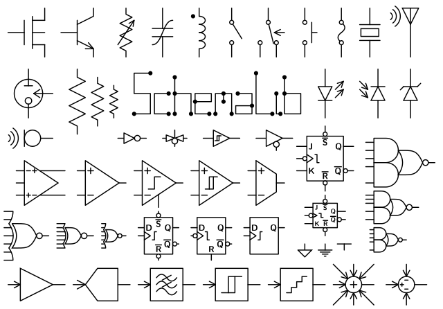

# SchemaLib

SchemaLib is a library of [SVG](https://en.wikipedia.org/wiki/SVG) symbols for drawing schematics of analog and mixed-signal (AMS) integrated circuits with [Inkscape](https://en.wikipedia.org/wiki/Inkscape).

<center></center>

You can find the comprenhensive list of all **819 symbols** [here](LIST.md).

## Symbol Rules

Each symbol candidate must meet the following requirements:

* [SVG](https://en.wikipedia.org/wiki/SVG) version 1.1
* [UTF-8](https://en.wikipedia.org/wiki/UTF-8) encoding
* Dimensions in mm
* Single group of elements
* Path elements only
* No transforms
* Absolute coordinates
* 0.25-mm line width
* Grid of 1mm &times; 1mm for terminals (when possible)
* Grid of 0.1mm &times; 0.1mm for shapes (except for text glyphs)
* Large (`*-l`), medium (`*-m`) and small (`*-s`) sizes
* Text labels typed in Latin Modern sans-serif bold font through [LaTeX](https://en.wikipedia.org/wiki/LaTeX) with preamble including:
```
\usepackage[utf8]{inputenc}
\usepackage[english]{babel}
\usepackage[T1]{fontenc}
\usepackage{lmodern}
\renewcommand{\familydefault}{\sfdefault}
```

* Line style:
```
style="fill:none;fill-opacity:1;stroke:#000000;stroke-width:0.25;stroke-linecap:round;stroke-linejoin:round;stroke-dasharray:none;stroke-opacity:1;shape-rendering:geometricPrecision"
```

* Closed shape style (white or black filling):
```
style="fill:#ffffff;fill-opacity:1;stroke:#000000;stroke-width:0.25;stroke-linecap:round;stroke-linejoin:round;stroke-dasharray:none;stroke-opacity:1;shape-rendering:geometricPrecision"
```
```
style="fill:#000000;fill-opacity:1;stroke:#000000;stroke-width:0.25;stroke-linecap:round;stroke-linejoin:round;stroke-dasharray:none;stroke-opacity:1;shape-rendering:geometricPrecision"
```

* Text label style:
```
style="fill:#000000;fill-opacity:1;stroke:none;stroke-width:0;shape-rendering:geometricPrecision"
```

## Creating Your Symbol

Methodology to build a SchemaLib symbol candidate using the open-source [Inkscape](https://en.wikipedia.org/wiki/Inkscape) vector editor:

1. Edit &rarr; Preferences &rarr; Input/Output &rarr; SVG output &rarr; Path data: `Absolute`
2. File &rarr; Document Properties &rarr; Display &rarr; Set custom page `Width` and `Height` to multiples of 1mm according to the size of large/medium/small existing symbols
3. File &rarr; Document Properties &rarr; Display &rarr; Set `Scale` to 1 mm per user unit
4. File &rarr; Document Properties &rarr; Grids: rectangular grid 1mm &times; 1mm
5. Edit your symbol terminals with snapping to grid
6. File &rarr; Document Properties &rarr; Grids: rectangular grid 0.1mm &times; 0.1mm
7. Edit your symbol shape with snapping to grid
8. If required, insert text labels through Extensions &rarr; Text &rarr; [TexText](https://textext.github.io/textext) with [`preamble.tex`](preamble.tex)
9. Select all (`Ctrl+A`) and apply ungroup (`Ctrl+U`) as times as required to flatten hierarchy
10. Layer &rarr; Layers and Objects (`Shift+Ctrl+L`): select symbol layer, Layer to Group (right click) and ungroup (`Ctrl+U`)
11. Select all (`Ctrl+A`) and Path &rarr; Object to Path 
12. Select all (`Ctrl+A`) and Extensions &rarr; Modify Paths &rarr; [Apply Transform](https://github.com/Klowner/inkscape-applytransforms)
13. Select all (`Ctrl+A`) and group (`Ctrl+G`) elements
14. File &rarr; Clean Up Document
15. File &rarr; Save as: Plain SVG

Finally, edit your [SVG](https://en.wikipedia.org/wiki/SVG) code following the style guide of exisiting symbols, i.e.:

* Name root `id` as file basename
* Remove unnecessary sections in root (e.g. `defs`)
* Name group `id` as symbol name
* Name paths `id` sequentially as `path1`, `path2`...
* Replace paths `style` as [above](#symbol-rules)
* Correct any rounding error caused by  [Inkscape](https://en.wikipedia.org/wiki/Inkscape) internal px units so all element coordinates are multiples of 0.1 user units (except for text glyphs)

## Usage Examples

Some examples of AMS IC schematics based on SchemaLib symbols are available [here](examples). Contributions are welcome!

## History

* Series 1.x: [CorelDraw](https://en.wikipedia.org/wiki/CorelDRAW) symbol library (2000-2003)
* Series 2.x: [Metapost](https://en.wikipedia.org/wiki/MetaPost) function library for [LaTeX](https://en.wikipedia.org/wiki/LaTeX) (2003-2010)
* Series 3.x: [SVG](https://en.wikipedia.org/wiki/SVG) symbol library (2010-present)
 
